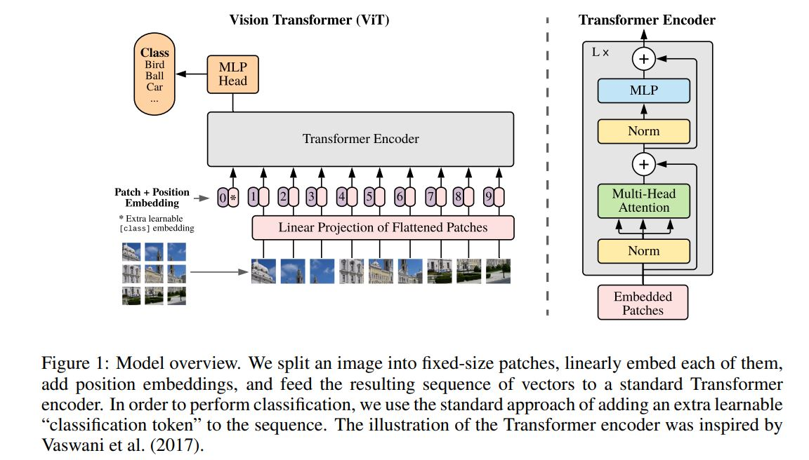

This work is based on the paper titled AN IMAGE IS WORTH 16X16 WORDS: TRANSFORMERS FOR IMAGE RECOGNITION AT SCALE from
google's research team. The paper proposes using a pure Transformer applied directly to image patches for image
 classification tasks. The Vision Transformer (ViT) outperforms state-of-the-art convolutional
 networks in multiple benchmarks while requiring fewer computational resources to train, after being pre-trained on
 large amounts of data.

Transformers have become the model of choice in NLP due to their computational efficiency and scalability.
In computer vision, convolutional neural network (CNN) architectures remain dominant, but some researchers have
 tried combining CNNs with self-attention. The authors experimented with applying a standard Transformer directly
  to images and found that when trained on mid-sized datasets, the models had modest accuracy compared to
  ResNet-like architectures. However, when trained on larger datasets, the Vision Transformer (ViT) achieved
  excellent results and approached or surpassed the state of the art on multiple image recognition benchmarks.

Figure 1 describes a model that processes 2D images by transforming them into sequences of flattened 2D patches.
The patches are then mapped to a constant latent vector size with a trainable linear projection. A learnable embedding
 is prepended to the sequence of patches and its state at the output of the Transformer encoder serves as the image
 representation. The image representation is then passed through a classification head for either pre-training or
 fine-tuning. Position embeddings are added to retain positional information and the sequence of embedding vectors
 serves as input to the Transformer encoder, which consists of alternating layers of multiheaded self-attention and MLP blocks.
